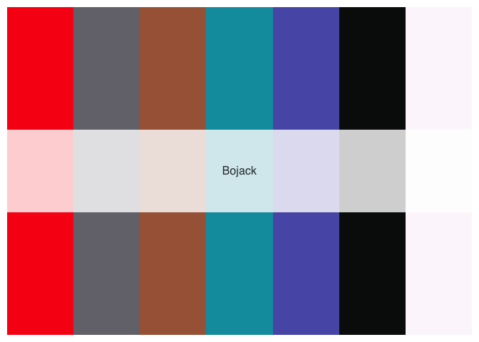
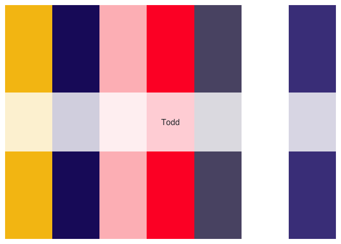
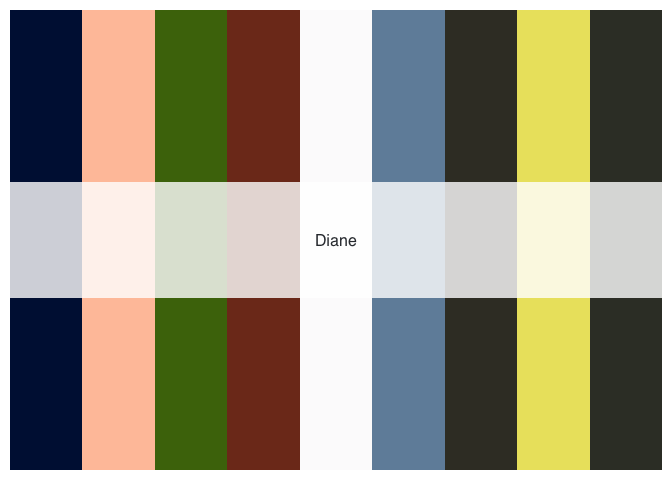
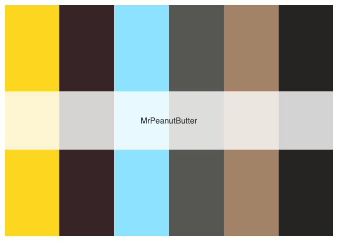
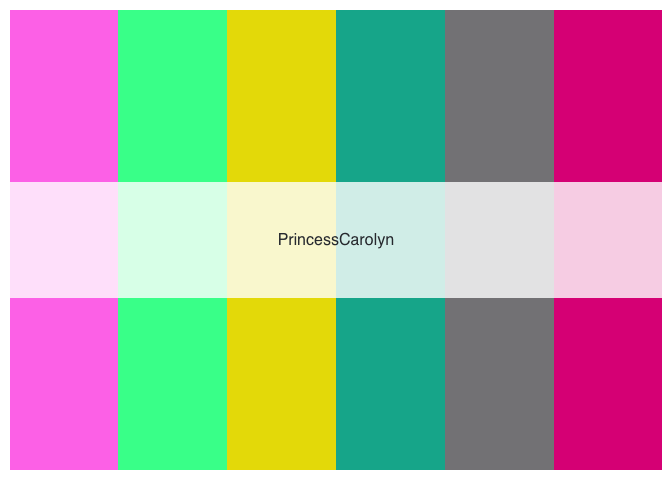
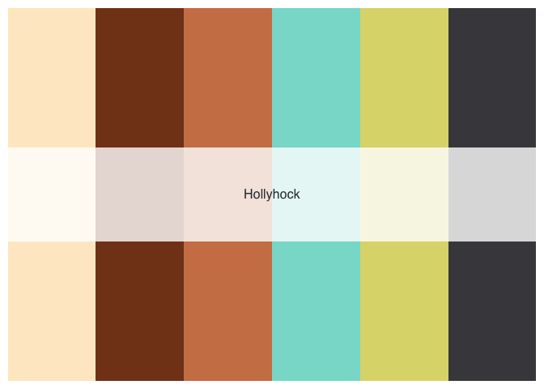
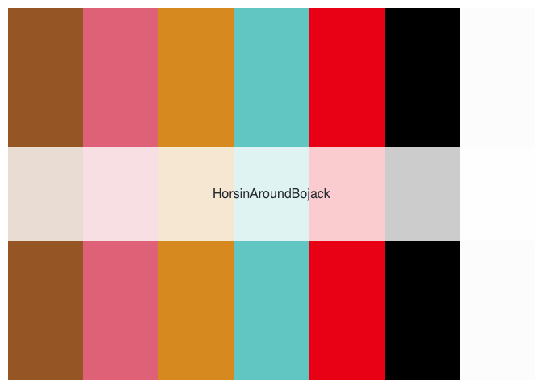
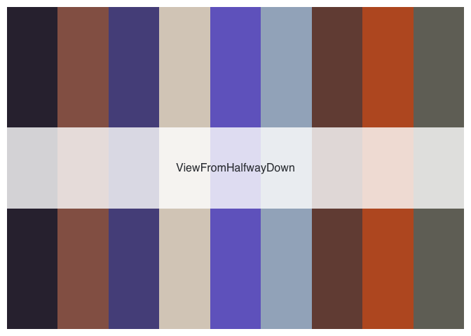
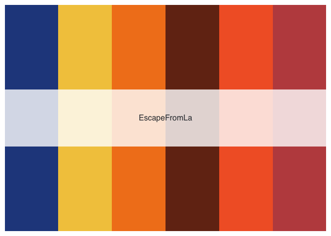
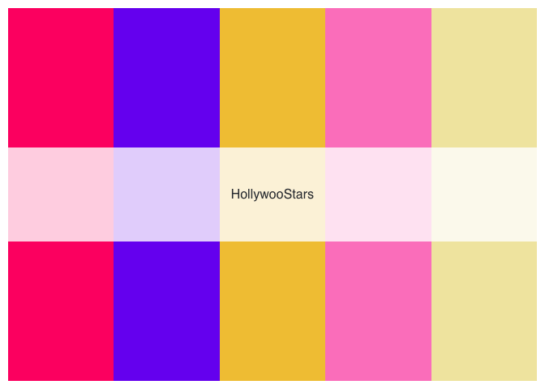

<!-- README.md is generated from README.Rmd. Please edit that file -->

# bojackpalette

<!-- badges: start -->
<!-- badges: end -->

The goal of bojackpalette is to provide clean and coordinated color
palettes inspired by characters and scenes from Bojack Horseman.

## Installation

You can install the development version from
[GitHub](https://github.com/) with:

``` r
# install.packages("devtools")
devtools::install_github("mwhalen18/bojackpalette")
```

Some palettes are generated from various stills from the show.


## Example

There are currently 11 total palettes to choose from.

``` r
library(bojackpalette)

names(bojack_palettes)
#>  [1] "Bojack"              "Todd"                "Diane"              
#>  [4] "MrPeanutButter"      "PrincessCarolyn"     "Hollyhock"          
#>  [7] "SarahLynn"           "HorsinAroundBojack"  "ViewFromHalfwayDown"
#> [10] "EscapeFromLa"        "HollywooStars"
```

You can create a palette using the following command:

``` r
palette = bojack_palette("Bojack")
```

You can also specify a specific number of colors from the palette.

``` r
bojack_palette("SarahLynn", 5)
```


## Palettes


