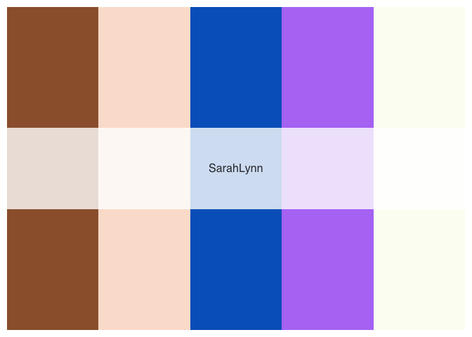
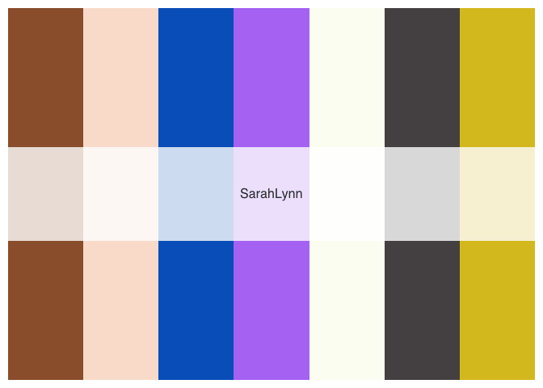

<!-- README.md is generated from README.Rmd. Please edit that file -->

# bojackpalette

<!-- badges: start -->
<!-- badges: end -->

The goal of bojackpalette is to provide clean and coordinated color
palettes inspired by characters and scenes from Bojack Horseman.

## Installation

You can install the released version of bojackpalette from
[CRAN](https://CRAN.R-project.org) with:

``` r
install.packages("bojackpalette")
```

And the development version from [GitHub](https://github.com/) with:

``` r
# install.packages("devtools")
devtools::install_github("mwhalen18/bojackpalette")
```

## Example

There are currently 8 total palettes to choose from.

``` r
library(bojackpalette)

names(bojack_palettes)
#> [1] "Bojack"             "Todd"               "Diane"             
#> [4] "MrPeanutButter"     "PrincessCarolyn"    "Hollyhock"         
#> [7] "SarahLynn"          "HorsinAroundBojack"
```

You can create a palette using the following command:

``` r
palette = bojack_palette("Bojack")
```

You can also specify a specific number of colors from the palette.

``` r
bojack_palette("SarahLynn", 5)
```

 \#\#
Palettes

``` r
print.palette = function(x, ...){
  n = length(x)
  old = par(mar = c(0.5,0.5,0.5,0.5))
  on.exit(par(old))
  image(1:n, 1, as.matrix(1:n), col = x,
        ylab = "", xaxt = "n", yaxt = "n", bty = "n")

  rect(0, 0.9, n + 1, 1.1, col = rgb(1, 1, 1, 0.8), border = NA)
  text((n + 1) / 2, 1, labels = attr(x, "name"), cex = 1, family = "Lato", col = "#32373D")
}

for(name in names(bojack_palettes)){
  (print.palette(bojack_palette(name)))
}
```



What is special about using `README.Rmd` instead of just `README.md`?
You can include R chunks like so:

``` r
summary(cars)
#>      speed           dist       
#>  Min.   : 4.0   Min.   :  2.00  
#>  1st Qu.:12.0   1st Qu.: 26.00  
#>  Median :15.0   Median : 36.00  
#>  Mean   :15.4   Mean   : 42.98  
#>  3rd Qu.:19.0   3rd Qu.: 56.00  
#>  Max.   :25.0   Max.   :120.00
```

You’ll still need to render `README.Rmd` regularly, to keep `README.md`
up-to-date. `devtools::build_readme()` is handy for this. You could also
use GitHub Actions to re-render `README.Rmd` every time you push. An
example workflow can be found here:
<https://github.com/r-lib/actions/tree/master/examples>.

You can also embed plots, for example:


In that case, don’t forget to commit and push the resulting figure
files, so they display on GitHub and CRAN.
